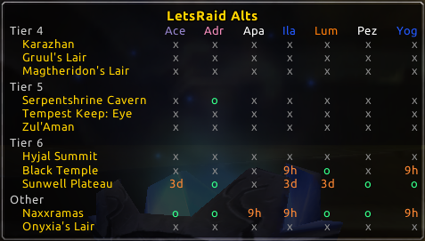

# Let's Raid

> Newest release available at: https://github.com/SiarkowyMods/LetsRaid/releases

Never miss a raid. Usage: /lr. Supports patch 2.4.3.

## Goals

- **Reduce raid downtime.** Find groups faster, even in casual setting,
  by letting others know your raiding preferences.
- **Make raid leader's job easier.** See immediately who is available and
  pick the best instance to go. Saved characters shouldn't clutter your view.
- **Build on existing game features.** Forming groups is a manual process
  in TBC. Aid the process with clever interface improvements.

## Roadmap

- [x] **Know which characters are saved.** Lockout durations are stored & synced
  between alts.
- [x] **Never miss a weekly run with instance focus.** Marked instances stand
  out visually in the overview so that you remember about running them easily.
- [x] **Sync lockouts with the Guild.** If enabled, lockouts are synced in
  player notes. You can see instance saves even between accounts this way!
- [ ] **See Guild lockouts at a glance.** You will be able to define raid groups
  & track their saves to plan in advance. Also, sorting by instance will make
  organizing one-off groups easier.
- [ ] **Utilize the LFG system.** With proper server support, making cross-guild
  raids will become an even easier process. Only log your desired character
  and access a bigger pool of raiders!

See [changelog](CHANGELOG.md) for a detailed description.

## Note on Synchronization

> This section describes the technical limitations of LetsRaid synchronization.

For lockout synchronization to work, one of the following cases must be met:

- **Your alts share the same account.** In this most basic scenario, alts will
  be able to see each other's instance lockouts & raid specialization settings.
  However, it is not always possible/desirable to keep several alts in the same
  account. There is a possibility to combine several accounts into a single one
  as far as the game client is concerned (by linking their `SavedVariables` dirs
  on disk with junctions or symbolic links). Please refer to the [external guide](http://web.archive.org/web/20201001161548/https://www.wowhead.com/guide=934/two-game-accounts-one-folder-now-with-mac).
- **Your alts are part of the same guild with ability to modify public notes.**
  In this scenario, you will be able to see instance lockouts between different
  accounts (without the need of linking them). LetsRaid uses public notes to
  store lockouts & raid specialization information, in a manner similar to QDKP
  keeping DKP information in officer notes. This is required so that you don't
  need to log multiple characters at the same time for synchronization to work.
  If you are not able to modify your player note, you either need to kindly ask
  your GM to enable it, or combine your accounts as hinted in previous scenario.

## Installation

> **IMPORTANT:** Please review the [note on synchronization](#note-on-synchronization) above.

- Find the latest [release](https://github.com/SiarkowyMods/LetsRaid/releases),
  download ZIP file from assets below & open the archive.
- Extract all folders from `LetsRaid-<version>\` into your `Interface\AddOns\`.
- Restart WoW client & confirm the addon(s) are shown in character login screen.

## Contributing

Feel free to post any bugs, requests and ideas in the
[issue tracker](https://github.com/SiarkowyMods/LetsRaid/issues).

You are invited to improve this addon by forking & opening
a [pull request](https://github.com/SiarkowyMods/LetsRaid/pulls).
Please make sure (1) an issue relevant to the proposed changes exists before
you work on the code and (2) your pull request targets the `develop` branch.

Thanks in advance!

## License

See [LICENSE](LICENSE) file.
